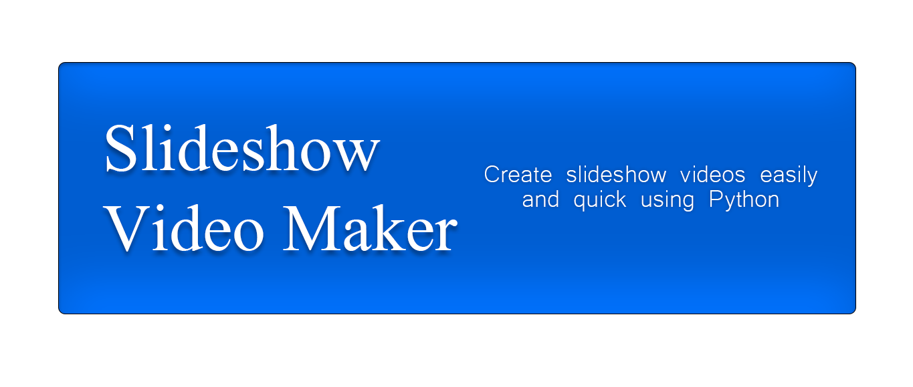

<div align='center'>
<a href='https://github.com/viniciusenari/slideshow-videomaker/blob/main/LICENSE'>

</a>
</div>
<br />

---

# 🎥 Description
This repositories contains Python scripts that take a set of pictures and an audio track and turn them into a slideshow video.   
It works by utilizing the Python libraries [Pillow](https://pillow.readthedocs.io/en/stable/) to resize images while keeping the image ratio and [MoviePy](https://zulko.github.io/moviepy/) to create video clips and render the video with the audio track.
# 🖥️ Installation Guide
Create a virtual environment.
```
python3 -m venv path/to/your-env
```

Activate your virtual environment. On Windows:
```
your-env\Scripts\activate.bat
```

On Unix or MacOS:
```
source your-env/bin/activate
```

Install dependencies
```
pip install -r requirements
```
MoviePy utilizes [ImageMagick](https://www.imagemagick.org/script/index.php) to create text images. Go to https://www.imagemagick.org/script/download.php and download and install the ImageMagick version compatible with your operating system. If you are on Windows, you will have to edit the `moviepy/config_defaults.py` file, which should be inside your virtual environment Lib folder, to include the path to your ImageMagick installation.
```
IMAGEMAGICK_BINARY = "C:\\Program Files\\ImageMagick_VERSION\\magick.exe"
```

# ▶️ How to Use
Place your images on the folder ```images\original``` and the audio track on folder ```song```. If you want a certain order in which images appear on the video, rename the files so that the alphabetical order matches your desired order.  
After that, run the app.py script.
```
python app.py
```
After you run it, it will prompt you to provide some parameters. They are the video title that will show up at beginning of the video, what resolution do you want the video to be, and the length of the audio track in seconds.
<div align="center">

</div>

## More in-depth customization
There are many parameters when doing the final render of the video. You may want to check them at [VideoClip.write_videofile](https://zulko.github.io/moviepy/_modules/moviepy/video/VideoClip.html#VideoClip.write_videofile) and set to your preferences on the ```write_video``` function in [MakeVideo.py](videomaker\MakeVideo.py)
```python
def write_video(video, bitrate = "16000k", threads = 1, filename = "video", preset = "ultrafast", fps = 24, codec = "mpeg4"):
    video.write_videofile(f'{filename}.mp4', fps = fps, codec = codec, threads = threads, preset = preset, bitrate = bitrate)
```
You can customize more your title card in the ```create_title_text_clip``` function in [TitleText.py](videomaker\TitleText.py). For example, you may want to change the RGB color.
```python
def create_title_text_clip(text, frame_color = (16, 78, 139)):
```

# 🏗️ Future Features
Below is a list of possible future features that could be implemented to this repository. You are also welcomed to contribute with features not listed below.
* Automatically find the length of the audio file.
* Support for more than one audio file.
* Add transitions. Fade-in/ Fade-out.